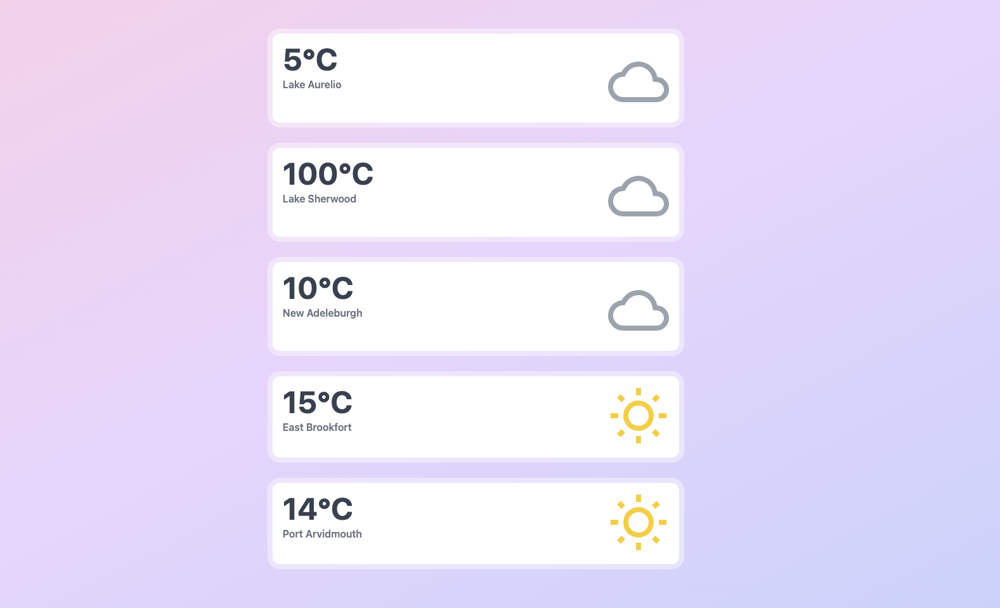

## Livewire real-time event listening demo

This is a simple example to show how we can broadcast Laravel event to Livewire component and show the result in real-time.

### How to run
Run the following commands to install the project: 
``` shell 
composer install
npm install
sail up -d
sail artisan migrate --seed
npm run dev
```

The `APP_PORT` is set to `9999`, so you'll be able to run the project at `http://localhost:9999` in the browser. Feel free to change it if you want.

You need to create an API key in a project in [ably](https://ably.com/). Set it to `ABLY_KEY` in `.env` file.

Now open up the terminal and run `sail artisan app:change-weather` command. 
It'll prompt for some information. If you feel it up, you'll see that the weather information in your browser page updated automatically.
